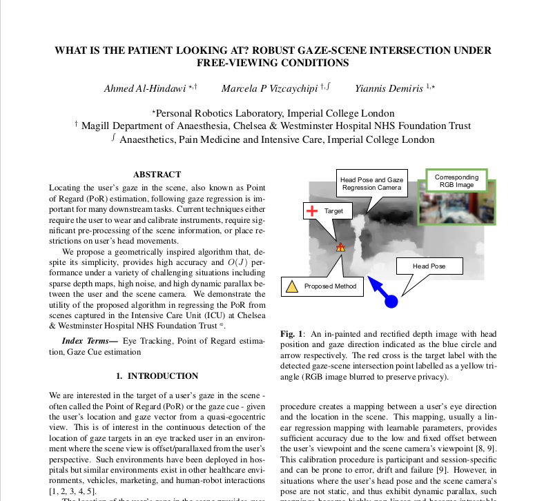

This repository containes code for the paper "What is the Patient Looking at: :WHAT IS THE PATIENT LOOKING AT? ROBUST GAZE-SCENE INTERSECTION UNDER FREE-VIEWING CONDITIONS:



### License + Attribution
The code is in this repository licensed under [CC BY-NC-SA 4.0](https://creativecommons.org/licenses/by-nc-sa/4.0/). Commercial usage is not permitted. If you use the code in a scientific publication, please cite the following:

```
@inproceedings{Al-HindawiICASSP2022,
author = {Ahmed Al-Hindawi and Marcela Paola Vizcaychipi and Yiannis Demiris},
title = {{WHAT IS THE PATIENT LOOKING AT? ROBUST GAZE-SCENE INTERSECTION UNDER FREE-VIEWING CONDITIONS}},
booktitle = {International Conference on Acoustics, Speech, and Signal Processing},
year = {2022},
month = {May}
}
```

## Overview
The code is split into two parts, a node to run inside ROS1 and another standalone version.

### ROS node
The [ros][./ros] directory contains a ROS package for real-time inference of gaze-cue/gaze-scene intersection while the [standalone](./standalone) provides the same code without ROS.


## Architecture
<p align="center">
  
</p>

## Results
<p align="center">
  
</p>

## More Information
Please see our [paper](./paper.pdf) in the main repository.
